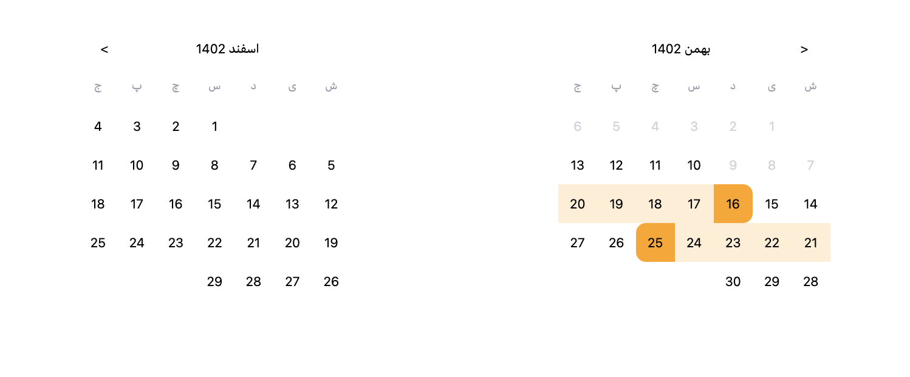

# Jalaali Range Datepicker



**Jalaali Range Datepicker** is a customizable range datepicker component for React, tailored specifically for Jalaali (Persian) calendar systems.

## Overview

This project utilizes Vite, React, and TypeScript to provide a robust and flexible solution for selecting date ranges in Jalaali calendar format.

## Features

- **Jalaali Calendar Support:** Seamlessly integrates with Jalaali calendar systems.
- **Range Selection:** Intuitively select date ranges with a user-friendly interface.
- **Customizable:** Tailor the styles and behavior to suit your application's requirements.
- **Responsive:** Ensures optimal performance across various devices and screen sizes.

## Installation

1. Clone the repository:

   ```bash
   git clone https://github.com/yourusername/jalaali-range-datepicker.git
   ```

2. Install dependencies:

   ```bash
   cd jalaali-range-datepicker
   yarn install
   ```

## Usage

1. Run the development server:

   ```bash
   yarn run dev
   ```

2. Open your browser and navigate to `http://localhost:5173` to see the demo.


## List of Dependencies

- **clsx**: ^2.1.0
- **moment-jalaali**: ^0.10.0
- **react**: ^18.2.0
- **react-dom**: ^18.2.0

### Development Dependencies

- **@types/moment-jalaali**: ^0.7.9
- **@types/react**: ^18.2.43
- **@types/react-dom**: ^18.2.17
- **@typescript-eslint/eslint-plugin**: ^6.14.0
- **@typescript-eslint/parser**: ^6.14.0
- **@vitejs/plugin-react-swc**: ^3.5.0
- **autoprefixer**: ^10.4.17
- **eslint**: ^8.55.0
- **eslint-plugin-react-hooks**: ^4.6.0
- **eslint-plugin-react-refresh**: ^0.4.5
- **postcss**: ^8.4.33
- **tailwindcss**: ^3.4.1
- **typescript**: ^5.2.2
- **vite**: ^5.0.8


## Contributing

Contributions are welcomed! If you have suggestions for improvements, please open an issue or submit a pull request.


## Contact

For questions or inquiries, feel free to contact [yourname](mailto:aliaharian5@gmail.com).